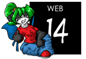
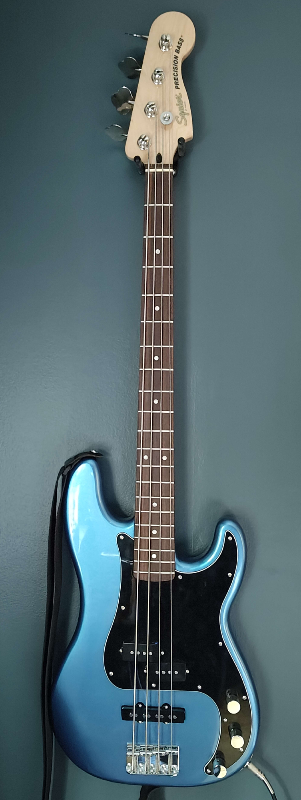

Hey! I am a student from Sweden, I like to write software and play bass guitar.

I like to build things simple, fast and easy to understand. I spend a lot of time playing with low-level programming, Linux, and whatever catches my eye that week. I write most of my projects in C. When I'm not coding I spend most of my time practicing bass and learning songs I like.

Studying Computer Science and IT at NTI in Luleå, Sweden.

## Technologies

While I'm always learning new things (and there's more I already know), these are the technologies I'm most comfortable with:

* C
    * Raylib
    * POSIX/Linux development
* Java
    * FabricMC mod development
    * PaperMC plugin development

This site is rated <a href="https://www.mabsland.com/Adoption.html" target="_blank">Web 14</a>

> This site contains slightly offensive material.  High chance of mild swearing, partial nudity, violence and adult themes.

---
# Blog

 
    <a href="{{ post.url }}" class="blogpost">
        <h3>{{ post.data.title }}</h3>
        <small>{{ post.date | date }}{{ post.url }}</small>
    </a>  

---

Location: <code>Northern Sweden</code>

Age: <code class="my-age"></code> years old.
